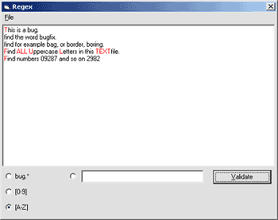



## HowTo use Regular Expressions with VB6

### Description

This sample shows you how you can use Regularexpressions in your VB6 Projects via the Microsoft VBScript Regular Expressions 5.5 Library. With the code you get an example file to run 3 predefined regular expressions. Additionally you can load your own Textfiles and define own Regular Expressions to query against the Text. Matches are highlighted in red in the Richtextbox. Download this and much more VB6 and .NET Source at www.visualsoft-net.de
 
### More Info
 

             |
---                |---
**Submitted On**   |2004-06-02 04:25:02
**By**             |[Mähr Stefan](https://github.com/Planet-Source-Code/PSCIndex/blob/master/ByAuthor/m-hr-stefan.md)
**Level**          |Advanced
**User Rating**    |4.7 (14 globes from 3 users)
**Compatibility**  |VB 6\.0
**Category**       |[Files/ File Controls/ Input/ Output](https://github.com/Planet-Source-Code/PSCIndex/blob/master/ByCategory/files-file-controls-input-output__1-3.md)
**World**          |[Visual Basic](https://github.com/Planet-Source-Code/PSCIndex/blob/master/ByWorld/visual-basic.md)
**Archive File**   |[HowTo\_use\_175277622004\.zip](https://github.com/Planet-Source-Code/m-hr-stefan-howto-use-regular-expressions-with-vb6__1-54141/archive/master.zip)

